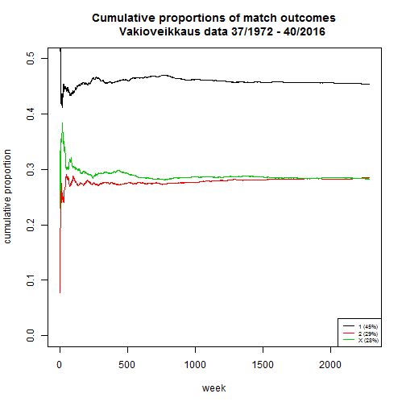

# P(three or more identical rows)

These codes are also found in prob_sim.R


```r
# Tuomo A. Nieminen 23.10.2016

# simulate the probability P(three or more identical rows)
# ---------------------------------------

# load the data (to get the  number of rows)
rivit <- read.csv2("Tilastot.csv", stringsAsFactors = FALSE)

# the size of the simulation
simsize <- 1e4

# unique integers represent unique combinations of rows
unique_rows <- 1:(3^13)

# a single simulation iteration is a sample of <n> rows
n <- nrow(rivit) # 2284
```


```r
# create an empty data.frame to store the simulated integer vectors as rows
df <- matrix(NA, nrow = simsize, ncol = n)

# draw a sample of <n> from the unique rows with replacement
# repeat <simsize> times and store the sampled integers
for(i in 1:simsize) df[i, ] <- sample(unique_rows, size = n, replace = T)
```


```r
# for each row, check if there are more than 2 of the same integer (this might be slow)
results <- apply(df, 1, FUN = function(v) any(table(v)>2))

# compute the proportion of true cases
sum(results)/simsize
```

```
## [1] 3e-04
```


# Cumulative proportions

These codes are also found in outcome_proportions.R


```r
# Tuomo A. Nieminen 23.10.2016

# load the data
rivit <- read.csv2("Tilastot.csv", stringsAsFactors = FALSE)
nr <- nrow(rivit)
```


```r
# create a list of tables of 1 x 2 frequencies
freqs <- apply(rivit, 1, table)

# combine the lists to a data.frame (ignore warning)
freqs <- as.data.frame(do.call(rbind, freqs))
```

```
## Warning in (function (..., deparse.level = 1) : number of columns of result
## is not a multiple of vector length (arg 10)
```

```r
# compute cumulative frequencies
cum_freqs <- cumsum(freqs)

# compute cumulative proportions
cum_prop <- cum_freqs / cumsum(rep(13, nr))
```


```r
# draw an empty plot
plot(1:nr, 
     main = "Cumulative proportions of match outcomes
     Vakioveikkaus data 37/1972 - 40/2016",
     ylab = "cumulative proportion", 
     xlab = "week",
     type = "n", ylim = c(0, 0.5))

# plot the cumulative proportions
for(i in 1:3) {
  lines(1:nr, cum_prop[, i], col = i) 
}

# add a legend to the plot
outcomes <- names(cum_prop)
outcomes <- paste0(outcomes, " (", round(100*cum_prop[nr, ],0), "%)")
legend("bottomright", legend = outcomes, col = 1:3, lty = 1, cex = 0.6, pt.cex = 1)
```




