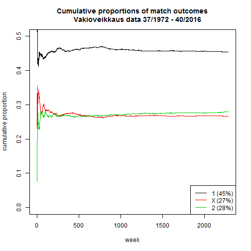

# Basic stats


```r
rivit <- read.csv2("Tilastot.csv", stringsAsFactors = FALSE)
nrow(rivit)
```

```
## [1] 2284
```

```r
table(do.call(c,rivit))
```

```
## 
##     1     2     X 
## 13464  8310  7918
```


# P(three or more identical rows)

The data included three of the same rows, which should be somewhat unlikely because there are 


```r
3^13
```

```
## [1] 1594323
```

unique possible rows.

The probability of observing three or more identical rows during the years included in the data was therefore simulated. 


```r
source("prob_sim.R")
ptwoormore
```

```
## [1] 0.001
```


# Cumulative proportions

Cumulative proportions of 1, X and 2 outcomes


```r
source("outcome_proportions.R")
```



# Frequencies of 0, 1, .., 13 homewins

According to the data, the proportion of hometeam wins ("1") is 0.45 and the proportions of draws and losses are almost identical.  

Here we compute the expected frequencies of rows with 0, 1, ..., 13 homewins and then compare to the observed frequencies.  

Expected homewins assumptions
1. the probability of a homewin is 0.45 for each match.
2. the probability of not a homewin is 0.55 for each match  


```r
source("homewins.R")
homewin_frequencies
```

```
##       expected observed
##  [1,]        1        2
##  [2,]       10       10
##  [3,]       50       47
##  [4,]      151      142
##  [5,]      308      330
##  [6,]      454      427
##  [7,]      495      484
##  [8,]      405      411
##  [9,]      249      252
## [10,]      113      125
## [11,]       37       39
## [12,]        8       13
## [13,]        1        2
## [14,]        0        0
```

